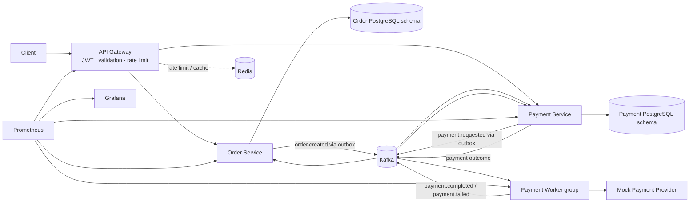

# PayFlow architecture

## Scope and request flow

PayFlow demonstrates reliable asynchronous order payment. The client talks only to the API Gateway. Product catalogs, inventory, shipping, and a customer-facing UI are outside the project scope.

## Ownership and responsibilities

| Component | Owns | Responsibilities |
| --- | --- | --- |
| API Gateway | Public HTTP surface; no business data | HS256 JWT authentication and role checks, DTO validation, Redis rate limiting and read cache, request/correlation IDs, public routing |
| Order Service | Orders and order outbox | Create/list/get/cancel orders; enforce order state transitions; publish `order.created`; consume payment outcomes and update order state |
| Payment Service | Payments, client idempotency records, payment outbox | Create one payment per order, return payment state, enforce payment transitions, publish `payment.requested`, consume worker results |
| Payment Worker | Operational job and DLQ records (not payment business state) | Persist requests before acknowledging Kafka, call provider with a stable idempotency key, retry transient failures, route exhausted work to DLQ, publish results |
| Mock Provider | Durable simulated provider outcomes in worker PostgreSQL | Simulate success, timeout, 5xx, rate-limit, and network failures; return the same successful outcome for the same provider idempotency key across worker restarts |
| Redis | Disposable cache and rate-limit state | Atomic fixed-window rate limits and ten-second user-scoped read cache. Cache loss is recoverable; database remains authoritative. |

Order and payment data use separate PostgreSQL schemas/databases and credentials. Compose publishes only the API Gateway; order, payment, and worker services stay on the internal network. A service must not query another service's tables; information crosses service boundaries through HTTP APIs or Kafka events. The worker has no direct access to payment tables.

## Order and payment lifecycle

Order states: `PENDING_PAYMENT` → `PAYMENT_PROCESSING` → `PAID` or `PAYMENT_FAILED`. `CANCELLED` is allowed only before a payment is processing or successful. A later success after cancellation requires an explicit compensating/refund workflow; that workflow is out of the initial scope and must not silently mark a cancelled order paid.

Payment states: `PENDING` → `PROCESSING` → `SUCCESS` or `FAILED`. Retryable provider failures remain eligible for processing and do not become terminal `FAILED` until retries are exhausted. Admin reprocessing of a terminal failure is an explicit transition back to `PENDING` with an audit record and a new processing generation; the payment identity/provider idempotency behavior must be preserved to prevent an accidental second charge.

## Event delivery and consistency

Delivery is **at least once**. Kafka events can be duplicated or delivered again after a consumer crash. The system promises idempotent business effects where the relevant durable key is available; it does not claim end-to-end exactly-once delivery.

Use a transactional outbox in each producer that also writes business data:

1. Order Service commits the order and its `order.created` outbox row in one PostgreSQL transaction.
2. Payment Service consumes `order.created`, then commits a payment row (unique by `order_id`) and its `payment.requested` outbox row together.
3. The worker stores each request as a durable job before committing its Kafka offset. It calls the provider using `paymentId` as the provider idempotency key. The mock provider stores the first successful outcome durably and returns the same outcome for repeats.
4. The worker publishes a result before marking the job complete. A crash can cause the result to be published again; the provider idempotency key prevents a second business charge, and downstream consumers apply idempotent state updates.
5. Payment Service commits the payment state update and a result/outbox record atomically where it emits a normalized outcome. Order Service consumes the outcome and applies it idempotently.

Outbox relays publish pending rows and mark them published only after broker acknowledgement. A crash may republish a row, so consumers keep an inbox/processed-event record or use an equivalent unique business constraint in the same transaction as their state change. Events are keyed by `orderId` or `paymentId` to preserve per-entity partition ordering. No service acknowledges a consumed event before its database transaction commits.

The provider timeout case is inherently ambiguous: the provider may have charged even if the worker did not receive a response. Reusing the same provider idempotency key is required. If a real provider cannot provide idempotent requests or a way to query the operation, automatic retries after ambiguous timeouts cannot guarantee no duplicate charge; the safe behavior is to mark the result as unknown for reconciliation rather than blindly submit a new charge. The mock provider will model idempotency so this behavior can be demonstrated.

## Shared infrastructure decisions

- **Kafka:** versioned event envelopes, durable topics, consumer groups, manual offset commits, keyed partitions, bounded retries, and a DLQ. Retries use exponential backoff plus jitter; retry topics/scheduling must not block unrelated partitions while waiting.
- **Redis:** an atomic fixed-window limiter allows 10 writes/minute/user, 120 reads/minute/user, and 10 login attempts/minute/IP. Rate-limit outage fails closed with `503`; cache outage falls back to the owning service/database. User-scoped order and payment GET responses expire after 10 seconds; order creation invalidates cached order lists.
- **Authentication:** the gateway issues one-hour HS256 JWTs for environment-configured local customer/admin accounts, checks roles, and derives identity only from verified claims. Internal service ports are not published; the gateway forwards the verified user ID over the Compose network.
- **Observability:** structured logs carry `requestId`, `correlationId`, `service`, timestamp, level, and entity IDs. Prometheus metrics cover HTTP latency/errors, Kafka processing/failures/lag, payment outcomes, retries, DLQ depth, and dependency latency. OpenTelemetry tracing follows after the core flow.
- **Health:** `/health` reports process liveness; `/ready` reports whether the dependencies required to serve that service are usable.

## Key trade-offs and guarantees

- Asynchronous events reduce request coupling and allow workers to scale independently, at the cost of eventual consistency. A newly created order can remain pending while payment processing catches up.
- The outbox avoids losing the intent to publish between a database commit and a Kafka publish. It introduces relay work and duplicate delivery, handled with idempotent consumers.
- PostgreSQL is authoritative; Redis is an optimization and rate-limit coordinator.
- Kafka partition count limits parallel consumption within one consumer group. More worker instances than assigned partitions do not increase consumption throughput; load tests should measure lag and partition utilization.
- A payment provider's idempotency and reconciliation capabilities bound the strongest possible no-double-charge guarantee.

## Operational failure expectations

| Failure | Expected behavior |
| --- | --- |
| Worker stops | Kafka retains unacknowledged requests; a replacement worker resumes consumption. |
| Provider transient failure | Retry with bounded exponential backoff and jitter; route exhausted events to DLQ. |
| PostgreSQL unavailable | Do not acknowledge Kafka input before its durable job/inbox write; affected HTTP operations return an error, readiness fails, and processing resumes when PostgreSQL returns. |
| Redis unavailable | Gateway readiness fails; API traffic also fails closed because the rate limiter cannot enforce its policy. Cache reads alone fall back to the owning service/database. |
| Duplicate Kafka event | Inbox/unique constraints and provider idempotency prevent repeated state effects and charges. |
| Ambiguous provider timeout | Repeat only with the same provider idempotency key; otherwise require reconciliation rather than issuing a fresh charge. |

## Architecture diagram

The Mermaid diagram above is the current source of truth. Update it whenever service ownership, event flow, or persistence boundaries change.
